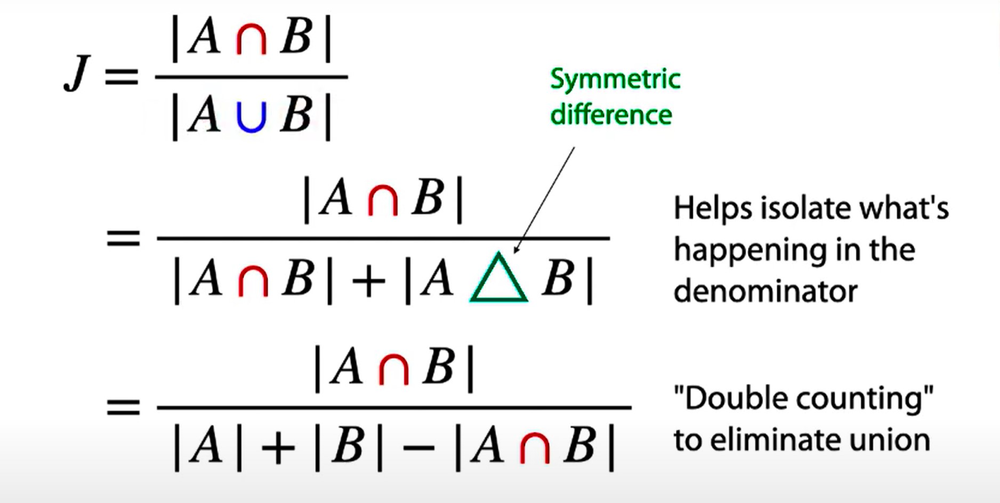
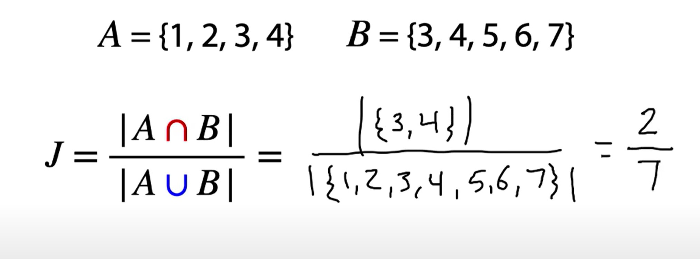
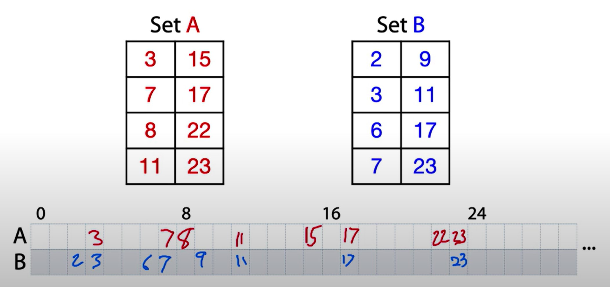
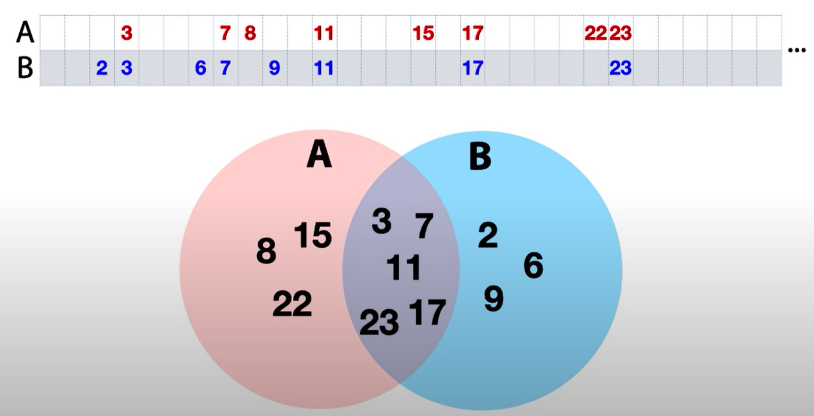
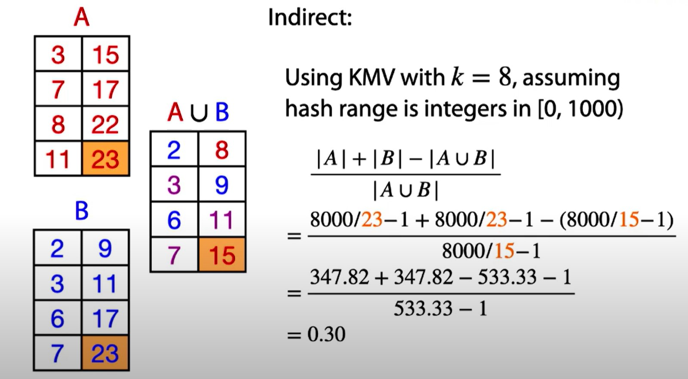

text => tokenizer => tids => minhash

# Deduplicating Training Data Makes Language Models Better
- https://arxiv.org/pdf/2107.06499.pdf
- https://github.com/google-research/deduplicate-text-datasets

## Methods for Identifying Duplicates

Cách đơn giản nhất là exact string match, tuy nhiên chưa đủ. 2 cách nữa là:

- Đầu tiên dùng suffix array để loại bỏ duplicated substrings từ dataset nếu chúng xuất hiện nguyên văn trong nhiều hơn một mẫu.

- Tiếp theo dùng MinHash, rất hiệu quả để estimate n-gram simlilarity giữa 2 cặp mẫu trong corpus, để loại bỏ toàn bộ các mẫu từ dataset néu chúng có n-gram overlap cao với bất cứ mẫu nào khác.

Ta coi dataset D = `{x_i}_{i=1}^N` là một tập của các mẫu x_i. Và các mẫu đó là một chuỗi các tokens:
`x_i = [ x_i^1, x_i^2, ...m, s_i^{s_i} ]`

- - -

# Similarity & MinHash
https://www.youtube.com/watch?v=aTwRpqUnQX8

Cách tính độ giống nhau giữa 2 tập hợp

## Cardinal
We find the 8 min hashes (bottom 8) for items in set A, and repeat for items in set B

Can we allocat hash values to a Venn diagram? Assume no collisions (each hash value is a distinct item)

Chạy từ trái qua phải, điền giá trị hàng A, và B vào sketch (A union B) được:
`2, (3), 6, (7), 8, 9, (11), 15`

# Cách tính khác
https://youtu.be/aTwRpqUnQX8?t=1707

- - -

# Data Deduplication using Locality Sensitive Hashing
https://www.youtube.com/watch?v=n3dCcwWV4_k

- - -

# Locality Sensitive Hashing
https://www.youtube.com/watch?v=cEMuUGUM9oA

- - -

