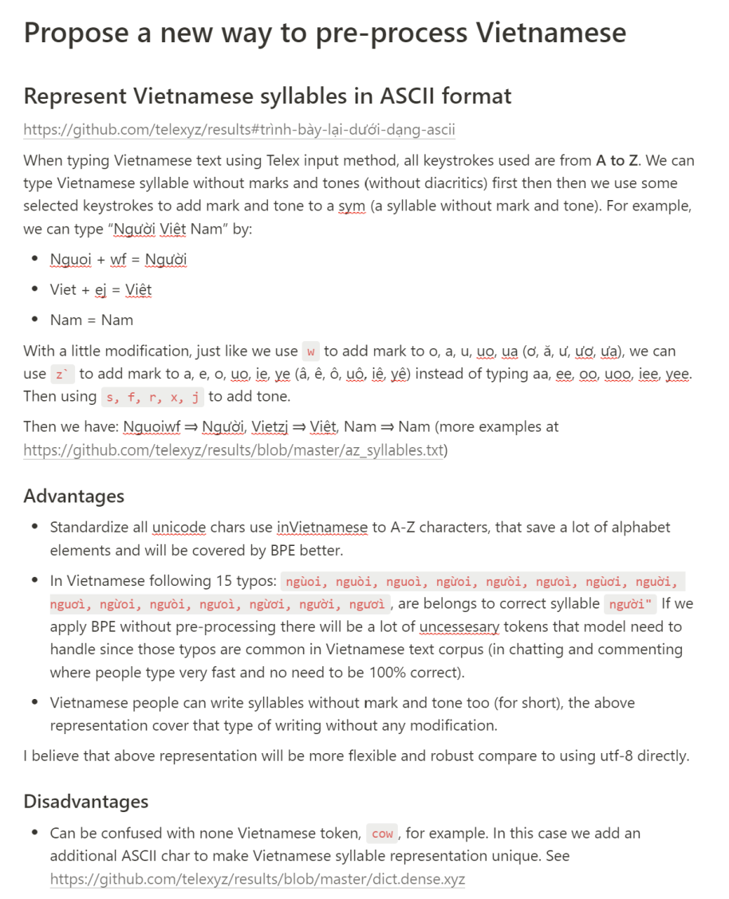

# Mấu chốt

- [ ] Làm thế nào để có metrics đánh giá "độ tốt" của văn bản?
  - Để có thể chọn văn bản từ tốt tới xấu cho đến một độ lớn nhất định thì dừng lại
  - Để khi huấn luyện chọn ra một tỉ lệ nhất định các văn bản tốt huấn luyện trước?

- [ ] Làm thế nào để lọc ra văn bản vừa "tốt" vừa "đa dạng" từ nhiều nguồn?
  - Cân bằng về số lượng tokens giữa các categories?

- - -

TODOs

- [ ] Chọn dữ liệu tương đồng với 1 tập dữ liệu đã có
  - [ ] Dùng [dsir](https://github.com/p-lambda/dsir) để lọc news có liên quan tới pháp luật

- [ ] Loại bỏ dữ liệu kém
  - [ ] lọc theo tỉ lệ âm tiết, chất lượng âm tiết ...
    - Điều chỉnh code của `engine`
  - [x] Các thuật toán dedup
    - [x] minhash
    - [x] SuffixArray Substring
    - [ ] Áp dụng minhash, suffix-array vào âm tiết TV (sau khi đã đánh số = u16)
  - Tham khảo
    - https://github.com/CarperAI/pilev2/tree/main/pile/processing/dedup
    - https://github.com/CarperAI/squeakily

- [ ] Cân bằng giữa các loại dữ liệu
  - [ ] Xem https://stanford-cs324.github.io/winter2022/lectures/data
  - [ ] Xem [unimax](./docs/unimax.md)

- [ ] Chọn dữ liệu tốt để huấn luyện trước (cách lấy mẫu khôn ngoan)
  - [ ] Cramming paper
  - [ ] Check [quality of dataset using kenlm](https://github.com/huggingface/olm-datasets/blob/main/pipeline_scripts/common_crawl/apply_bigscience_filters.py)

- - -

# Kịch bản tiền xử lý dữ liệu
> Cramming paper có nhiều ý tưởng tốt cho limited computing power. `bigscience-workshop` có pipeline tiền xử lý dữ liệu chỉnh chu nhất.

- https://github.com/JonasGeiping/cramming/tree/main/cramming/data
- https://github.com/bigscience-workshop/data-preparation
- https://github.com/bigscience-workshop/data_tooling

# Công cụ mạnh để xử lý ngữ liệu lớn
- https://github.com/telexyz/engine phân tách âm tiết tiếng Việt và thống kê dữ liệu
- https://github.com/kpu/kenlm n-gram language model nhanh nhất, python binding
- https://github.com/facebookresearch/fastText word embedding & text classifier

# Phân tích tiếng Việt
- Dữ liệu lấy mẫu https://github.com/telexyz/data
- Kết quả phân tích https://github.com/telexyz/results

# vi500: 500GB ngữ liệu tiếng Việt
- [x] Sưu tầm "dữ liệu" đủ lớn, đủ đa dạng (ngoài tin tức, các dạng khác rất ít)
  - [x] Nguồn
    - Lọc từ https://github.com/CarperAI/pilev2 (chuẩn bị public)
    - Lọc từ https://github.com/EleutherAI/polyglot#polyglot-east-asian-wip (chuẩn bị public)
    - https://huggingface.co/datasets
    - https://www.kaggle.com/datasets

  - [x] cc-100 [vi](https://data.statmt.org/cc-100/vi.txt.xz) (166G, 1 file text, không phân chia theo văn bản)
  - [x] OSCAR [vi](https://huggingface.co/datasets/oscar-corpus/OSCAR-2201/tree/main/compressed/vi_meta) (99GB)
  - [x] C4 [vi](https://huggingface.co/datasets/allenai/c4/tree/main/multilingual) (310GB)
  - [ ] NLLB [vi](https://huggingface.co/datasets/allenai/nllb) (19G)

  - [x] Tin tức
    - [ ] Cần phân rã và cân đối theo categories (tin tức, khoa học, kiến thức, xã hội, luật pháp ...) và cân đối lại
    - https://huggingface.co/datasets/bigscience-data/roots_vi_binhvq_news_corpus (20GB đã lọc)
      - Applied: dedup_document, dedup_template_soft, filter_remove_empty_docs, filter_small_docs_bytes_300
    - https://huggingface.co/datasets/truongpdd/vietnews-dataset (34GB lọc hay chưa?)
    - Có thể dùng dsir để lọc theo định hướng

  - [x] Wikipedia (1GB nén)
    - https://dumps.wikimedia.org/viwiki (1GB nén, download trực tiếp)
    - https://huggingface.co/datasets/truongpdd/viwiki-dummy (240MB)
    - https://huggingface.co/datasets/bigscience-data/roots_vi_wikipedia (257MB)

  - [x] Truyện, thơ (1.1GB)
    - https://huggingface.co/datasets/truongpdd/vietnamese_story (480MB)
    - https://huggingface.co/datasets/truongpdd/vietnamese_poetry_story (538MB)
    - https://huggingface.co/datasets/bigscience-data/roots_vi_vietnamese_poetry (57MB)
    - https://huggingface.co/datasets/truongpdd/vietnamese_poetry (64MB)
    - https://huggingface.co/datasets/truongpdd/luc-bat (33MB)

  - [ ] Sách
    - ...

  - [ ] Văn bản chính quy
    - Đang crawl ước tính từ khoảng 20G

  - [ ] Khác?
    - Diễn đàn
    - Mạng xã hội
    - Public chat room
    - ...

- - -

