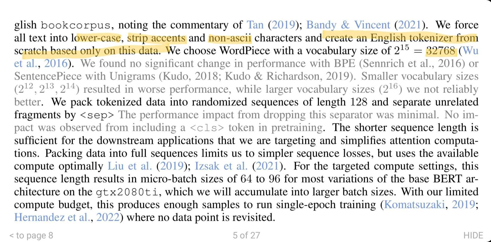
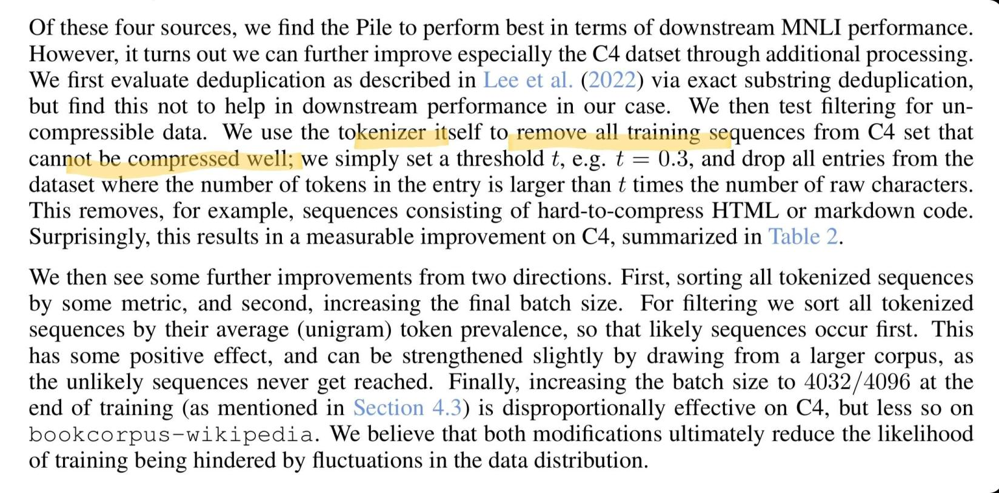

https://arxiv.org/pdf/2212.14034.pdf

## 4.4 TỐI ƯU HÓA TẬP DỮ LIỆU
Khi việc thay đổi kiến trúc mô hình không đạt thêm hiệu quả ngoại trừ tăng hiệu quả tính toán (do scaling laws).
Tuy nhiên, __scaling laws không ngăn cản chúng ta đào tạo trên dữ liệu tốt hơn__. Khi chúng ta đã cố gắng đào tạo được nhiều tokens nhất trên giây, chúng ta nên tìm cách __đào tạo trên những tokens tốt hơn__.

We consider two data based pathways to better down-scaling:
1. we can __filter, process, or sort__ the existing data in various ways.
2. we can swap our data source.

Bốn nguồn dữ liệu chính, 3 nguồn từ the pile là: Gutenberg, Books3 và Wikipedia (en), và lấy __4 triệu__ entries đầu tiên từ chúng để đủ tokens cho một lần chạy (single pass). Sau đó lấy từ C4 (bản filtered của commoncrawl) __20 triệu__ entries đầu tiên (4x the pile). Cuối cùng, huấn luyện WordPiece tokenizer riêng cho từng nguồn dữ liệu (xem mục 4.1)
> _Có 4 tokenizers khác nhau cho 4 nguồn dữ liệu (3 từ the pile, 1 từ C4)?_

Trong bốn nguồn này, chúng tôi nhận thấy the Pile hoạt động tốt nhất in terms of downstream MNLI performance. Tuy nhiên, hóa ra chúng ta có thể cải thiện hơn nữa, đặc biệt là bộ dữ liệu C4 thông qua quá trình xử lý bổ sung:

- We first evaluate deduplication via exact substring deduplication, but find this not to help in downstream performance in our case.
> _Có thể kết luận loại bỏ mẫu xấu tốt là quan trọng hơn dedup?_

- We then test filtering for uncompressible data. We use the tokenizer itself to remove all training sequences from C4 set that cannot be compressed well; we simply set a threshold t, e.g. `t = 0.3`, and drop all entries from the dataset __where the number of tokens in the entry is larger than t times the number of raw characters__. This removes, for example, sequences consisting of hard-to-compress HTML or markdown code. Surprisingly, this results in a measurable improvement on C4, summarized in Table 2.
> _Nén ở đây có nghĩa là hàm lượng thông tin nhiều (nhiễu loạn), tknz không làm giảm được độ dài dữ liệu._
> Note: vi500 làm điều tương tự bằng cách định nghĩa tỉ lệ độ dài âm tiết / độ dài toàn bộ văn bản nếu < 80% thì loại văn bản đó ra.

We then see some further improvements from two directions:
- First, __sorting all tokenized sequences__ by some metric, and 
- Second, increasing the final batch size !!

For filtering we sort all tokenized sequences by their average (unigram) token prevalence (đang lưu hành), so that likely sequences occur first. This has some positive effect, and can be strengthened slightly by drawing from a larger corpus, as the unlikely sequences never get reached.
> _Các mẫu được lưu hành nhiều hơn ưu tiên huấn luyện trước ?? Xác định độ lưu hành bằng tính trung bình độ phổ biến của unigram (có thể dùng bigram too)_

Finally, increasing the batch size to 4032/4096 at the end of training (as mentioned in Section 4.3) is disproportionally effective on C4, but less so on bookcorpus-wikipedia. We believe that both modifications __ultimately reduce the likelihood of training being hindered by fluctuations in the data distribution__.
> _Tăng batch-size giống như 1 cách fine-tune ??_

### Vocabulary Size

Increasing the vocabulary size would __compress data further__ (albeit vanishingly after some point), which would allow for more information to be compressed into the fixed number of tokens that can be ingested during the crammed training run. In Figure 3, we find that for bookcorpus-wikipedia data, larger vocabulary sizes correlate with larger average GLUE score, although the effect is plateauing for the MNLI task around the original 32768 vocabulary size. Moving forward, we hence keep this vocabulary size.
> _Vấn đề là làm sao để compress đc nhiều data với số vocab size cho trước!_

- - -

Để huấn luyện tknz, với TA, họ chuyển text sang dạng viết thường và loại bỏ các ký tự không phải ASCII. Với họ vocab_size = 2^15 là tối ưu. Sau đó họ đóng gói dữ liệu đã được tknz một cách ngẫu nhiên có độ dài 128 (??) và phân biệt với nhau bởi token `<sep>` Giới hạn độ dài quyết định bởi downstream tasks. Họ chọn seq len ngắn bởi nó không ảnh hưởng tới perf của downstream tasks và để tiết kiệm tính toán cho cơ chế attn. micro-batch sizes họ chọn là 64 hoặc 96 và bước huấn luyện cuối họ dồn vào 1 batch size lớn (vài nghìn).


Việc sử dụng bản thân tknz để loại bỏ dữ liệu "xấu" có vẻ hấp dẫn. Vì tknz quyết định tỉ lệ nén của câu đầu vào, nếu câu đầu vào tận dụng được tknz thì đó là câu "tốt" :)

Sau đó họ cải tiến bằng cách sắp xếp tokenized seqs theo 1 thứ tự ưu tiên nhất định (huấn luyện tokens tốt trước). Và ở lần huấn luyện cuối họ tăng batch size lên 4032 hoặc 4096 để làm giảm sự phân bố không đều của dữ liệu (??)



=> Cần kiểm tra code từng tricks https://github.com/JonasGeiping/cramming/tree/main/cramming/data

- - -

https://medium.com/geekculture/paper-dive-cramming-training-a-language-model-on-a-single-gpu-in-one-day-7965f47f7e8d

- The maximum sequence length was limited to 128, due to memory constraints, as such any additional optimizations, like sparse attentions would not have helped.
- The `<cls>` token did not help
- Only __one epoch__, the training data was too large to have multiple passes, as such overfitting was not an issue

Training
- Optimizer: Adam with weight decay of 0.01, β1 = 0.9, β2 = 0.98
- Gradient clipping at a clip value of 0.5
- One-cycle learning rate scheduler
- Gradient accumulation with optimal batch size between 1536–4032 and micro-batch of 96
- No dropout
- Original BERT 32768 vocabulary size
- For fine-tuning: the batch size of 16 and learning rate of 4 × 10−5 with cosine decay, 5 epochs.

- - -

BERT ONE DAY ONE GPU

https://twitter.com/giffmana/status/1608568396496646147

4/N Data: en
- Short seq and packing with `<sep>`. I like simple!
- `<cls>` token unnecessary; we found the same with ViT
- Use large batches by acc grads across μbatches
- 1-epoch @arankomatsuzaki

6a/N training
- Stick to the simplest MLM objective
- Optimizer: Adam. No win from fancier.
- I want to point out that AdaFactor is meant to save memory but behave like Adam, so no win is a win!
- They mention no win from Shampoo @_arohan_ but aren't confident it's a good impl.

@_arohan_: I also checked the code and found an issue. Epsilon used is 1e-12, the matrix inverse pth root method doesnt seem to scale by that max eigen value. If you had the latter, f32 numerics best we can do is 1e-6 (overton rule) rest will fail. Without relative epsilon, need f64. Inverses do often fail to converge, and special handling needs to be done otherwise updates will cause havoc to training trajectory.


https://twitter.com/jonasgeiping/status/1611382345369616386


- - -

https://github.com/JonasGeiping/cramming/blob/main/cramming/data/curriculum_sorting.py
- sắp xếp dataset theo unigram distribution (huấn luyện mẫu phổ thông trước?)

Tự download dữ liệu và huấn luyện mô hình 100 triệu tham số
```sh
python pretrain.py name=bert data=bookcorpus-wikipedia arch=bert-original train=bert-original
```
